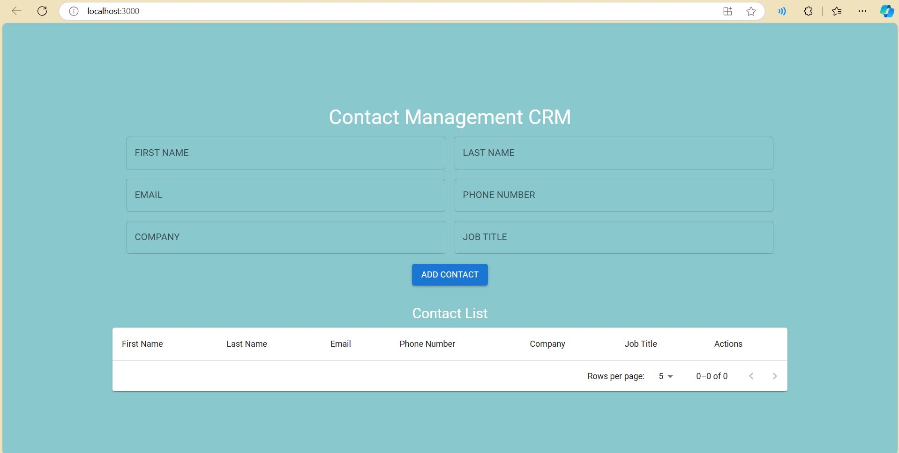
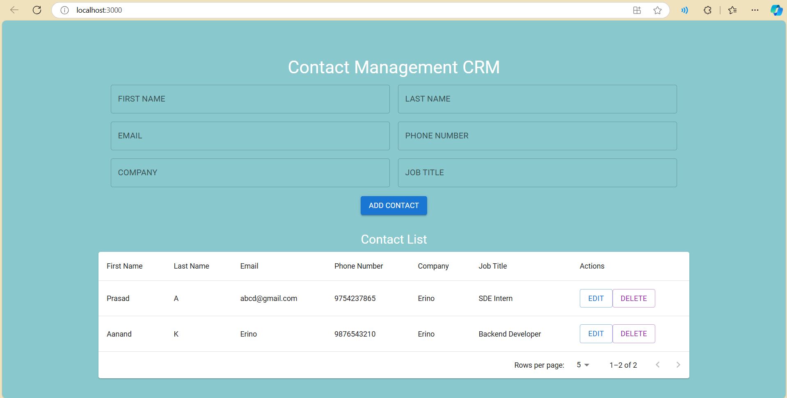

# Contact Management CRM

## 📋Description

This project is a **Contact Management CRM** built with **React**, **Node.js**, **Express**, and **MySQL**. It allows users to manage contacts, including adding, updating, deleting, and viewing contact details. The frontend is built using React with Material-UI for modern UI components, while the backend is powered by Node.js and Express. MySQL is used as the database to store and manage user and contact data.

### Key Features:
- Add, update, delete, and view contact information.
- Simple and clean UI using Material-UI.
- User authentication to keep contact data secure.
- Backend API built using Node.js and Express.
- Persistent data storage using MySQL.

## 🛠️ Technologies Used:
- **Frontend**: React, Material-UI
- **Backend**: Node.js, Express
- **Database**: MySQL

## Screenshots

### HomePage


### Contacts Table(CRUD Applicable) 


## 🔧 Setup Instructions

### Prerequisites
Before setting up the project, make sure you have the following installed:
1. **Node.js** (v14.x or higher) – [Download and Install Node.js](https://nodejs.org/)
2. **MySQL** (v5.7 or higher) – [Download and Install MySQL](https://dev.mysql.com/downloads/installer/)
3. **Git** (optional, for version control) – [Download Git](https://git-scm.com/)

### Step 1 : Clone the Repository

```bash
git clone https://github.com/321prasad0058/contact-management-crm.git
cd contact-management-crm
```
### Step 2 : Setup Backend
```bash
cd contact-management-crm
npm install
```

## Configure database in backend/config/.env
```bash
DB_HOST=localhost
DB_USER=root
DB_PASSWORD=your_mysql_password
DB_NAME=contact_db
```

## Create the database and tables:

In MySQL, run the following commands:

sql
Copy code
CREATE DATABASE contact_db;
USE contact_db;

Create Users table
```bash
CREATE TABLE users (
  id INT AUTO_INCREMENT PRIMARY KEY,
  username VARCHAR(255) NOT NULL,
  email VARCHAR(255) NOT NULL,
  password VARCHAR(255) NOT NULL
);
```
Create Contacts table

```bash
CREATE TABLE contacts (
  id INT AUTO_INCREMENT PRIMARY KEY,
  name VARCHAR(255) NOT NULL,
  email VARCHAR(255),
  phone VARCHAR(20),
  address TEXT,
  user_id INT,
  FOREIGN KEY (user_id) REFERENCES users(id)
);
```
## Start the backend server :

```bash
node server.js
```

### Step 3 : Setup Frontend

```bash
cd crm-frontend
npm install
npm start 
```
The frontend application should now be running at http://localhost:3000

###⚙️ How the App Works : 
## Frontend (React + Material-UI):
The frontend is built with React, allowing dynamic UI updates without needing to reload the page.
Material-UI components are used to ensure a clean and responsive UI.
Users can interact with a form to add new contacts, update existing ones, or delete them.
Contact data is displayed in a table format, where each entry has options for editing or deleting.

## Backend (Node.js + Express):
The backend provides a RESTful API to handle CRUD operations (Create, Read, Update, Delete) for contacts.
Express is used to set up the routes and handle requests.
The backend communicates with the MySQL database to store and retrieve contact data.
## Database (MySQL):
MySQL is used to persist contact data, which includes name, email, phone, and address.
The database is also used for user authentication to secure the CRM.

## 🛠️ Challenges and Solutions : 

Challenge 1: Database Integration
Integrating MySQL with Node.js was challenging, especially setting up the proper queries for retrieving, inserting, and updating contact data. I had to ensure the proper relationships between the users and contacts tables and maintain referential integrity.

Solution: I used MySQL2 for Node.js to interact with the database and utilized ORM to handle the queries efficiently. Additionally, I used async/await for handling asynchronous operations.

Challenge 2: Handling CORS
When making requests from the frontend to the backend, I encountered CORS issues because the server and client were on different ports during development.

Solution: I solved this by using the cors package in Express to allow cross-origin requests:

```bash
Copy code
npm install cors
```
Then in server.js (Express file):
```js
const cors = require('cors');
app.use(cors());
```

Challenge 3: Frontend UI Design
The initial UI design did not look polished, and the form inputs were hard to read against the background.

Solution: I decided to use Material-UI to implement clean, modern components like form inputs, buttons, and tables. This greatly improved the visual appeal and usability of the app.
